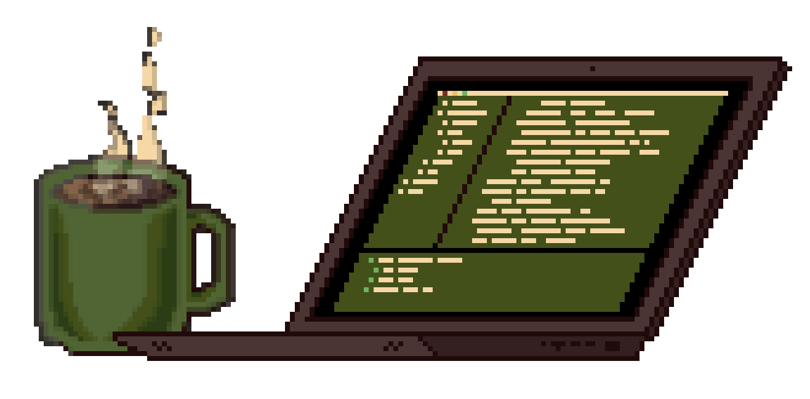

### Nice to meet you 👋
I'm Tat, a philosophy graduate in my previous life, and I am currently on my path to becoming a software engineer.
***
### About me
- 🚀 Current focus: Expanding my tech stack and learning the basics of fullstack development: Testing, virtualisation, responsive and dynamic websites, localisation, JPA, ...
- 💡 I was a trained peer-to-peer writing tutor in a university writing center. I have helped students overcome difficulties in academic writing and developed Open Educational Resources based on research. Learning from others as well as helping others understand are genuinely gratifying experiences for me.
- 💫 I love translating things:
  - complex stuff into simple bits,
  - concepts from one professional discipline into the language of another,
  - and ideas into code.
- 💬 My passion for language runs deep. It's a powerful tool that allows us to create and communicate meaning, as well as connect with and understand each other. I find it fascinating how natural and coding languages are both bound to logic, yet offer room for infinite possibilites.
- 🖼️ Occasionally, I dabble with pixel art.
- 🗣️ Native in German, fluent in English.

***
### 📍 Braunschweig, Germany
***
### 🧰 Languages and Frameworks

  &nbsp;
  &nbsp;
  &nbsp;
  &nbsp; 
  &nbsp; 
  &nbsp;
  &nbsp;
  &nbsp;
  &nbsp;
  &nbsp;
  &nbsp;
  &nbsp;
  &nbsp;
  &nbsp;

***
### 🏗️ Tools and Platforms

  &nbsp;
  &nbsp;
  &nbsp;
  &nbsp;
  &nbsp;
  &nbsp;
  &nbsp;
  <a href="https://moodle.org/"></img></a>&nbsp;
  <a href="https://learn.microsoft.com/credentials/certifications/azure-fundamentals/?practice-assessment-type=certification"></img></a>&nbsp;

***
Have a great day! ✨

***

