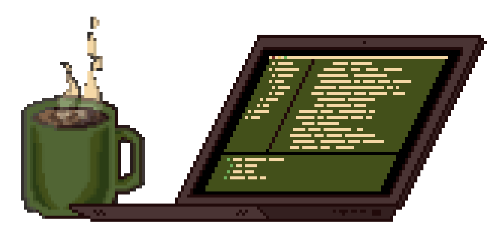

### Nice to meet you 👋

***
### Languages and Frameworks

#### 🧰 Backend

  
  
   
    

#### 🖥️ Frontend

  
  
  
  
  
  
  
  
  
  
  
    

#### 🧹 Testing

  
  
  
   

#### 📖 Other

  
  
    

  

***
### Tools and Platforms

#### 🏗️ Build Tools

  <a href="https://gradle.org/"></img></a>
  <a href="https://maven.apache.org/"></img></a>
  <a href="https://vite.dev/"></img></a>
      
  <space/>

#### 🛢️ Database

  <a href="https://mariadb.org/"></img></a>  
  <a href="https://www.mysql.com/"></img></a>
  <a href="https://www.postgresql.org/"></img></a>
    

#### ❯❯❯❯❯ CI/CD

  
  <a href="https://docs.gitlab.com/ci/"></img></a>
  <a href="https://testcontainers.com/"></img></a>
  <a href="https://docs.renovatebot.com/"></img></a>
    

####  📦 Other

  
  
  
  
  
  
  
  <a href="https://moodle.org/"></img></a>
  <a href="https://learn.microsoft.com/credentials/certifications/azure-fundamentals/?practice-assessment-type=certification"></img></a>  
    
  

  
***
Have a great day! ✨
***

